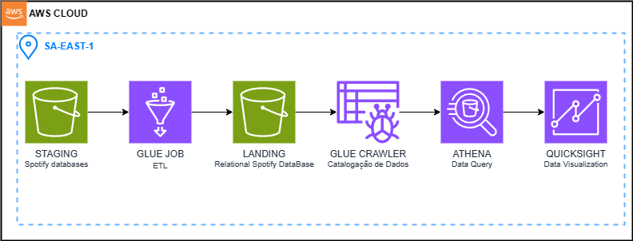

# spotify-data-engineer
Engineering Project using AWS resources provisioned with terraform scripts (iac)

<h3> Task tracking: </h3>
<h5>
    <ul>
        <li><input type="checkbox"> Architecure Plan </li>
        <li><input type="checkbox" checked> Provider configuration</li>
        <li><input type="checkbox" checked> S3 Crate</li>
        <li><input type="checkbox" checked> Upload S3 objects - spotify database</li>
        <li><input type="checkbox" checked> Github Workflow SetUp - Terraform commands </li>
        <li><input type="checkbox"> Glue Job - Extract </li>
        <li><input type="checkbox"> Glue Job Script - Trasnfromation </li>
        <li><input type="checkbox"> Glue Job - Load </li>
        <li><input type="checkbox"> Glue Crawler</li>
        <li><input type="checkbox"> Athena Query</li>
        <li><input type="checkbox"> QuickSight Dash</li>
    </ul>
</h5>

<h3> Project Architecture </h3>

